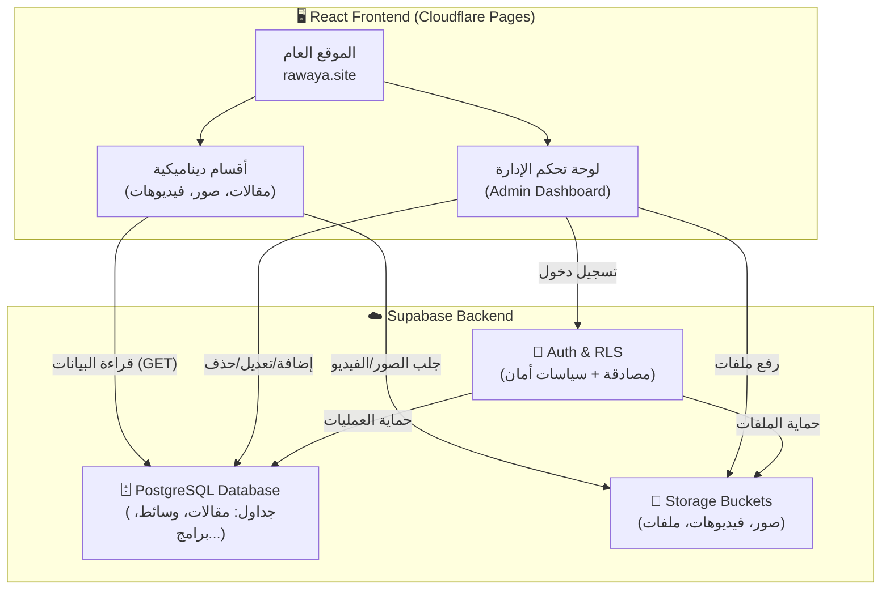

# 🏗️ خطة بناء نظام إدارة المحتوى (CMS) — منصة «رَوَايَا»
## تحويل المنصة من موقع ثابت إلى منصة ديناميكية متكاملة

---

## 📋 نظرة عامة

| البند | التفاصيل |
|---|---|
| **الهدف** | تمكين أ. نرمين من إضافة/تعديل/حذف المقالات والصور والفيديوهات والبرامج من لوحة تحكم سهلة بدون الحاجة لمبرمج |
| **التقنيات** | React 19 + TypeScript + Supabase (Database + Storage + Auth) + Tailwind CSS |
| **قاعدة البيانات** | Supabase (PostgreSQL مُدار) — مجاني حتى 500 MB بيانات + 1 GB ملفات |
| **التخزين** | Supabase Storage — لرفع الصور والفيديوهات والملفات |
| **المصادقة** | Supabase Auth — تسجيل دخول بالبريد الإلكتروني + كلمة مرور (بديل عن PIN الحالي) |
| **الاستضافة** | Cloudflare Pages (كما هو حالياً) — بدون تغيير |
| **عدد المراحل** | 6 مراحل |
| **الوقت التقديري** | 4-6 ساعات عمل برمجي |

---

## 🏛️ المعمارية الجديدة



---

## 🗄️ تصميم قاعدة البيانات (Database Schema)

### جدول 1: `articles` — المقالات والمحتوى التربوي

| العمود | النوع | الوصف |
|---|---|---|
| `id` | `uuid` (PK) | معرف فريد تلقائي |
| `title` | `text` | عنوان المقال |
| `slug` | `text` (UNIQUE) | رابط المقال الصديق لمحركات البحث |
| `category` | `text` | التصنيف (تربية وجدانية، فكر قرآني، تنمية وعي...) |
| `excerpt` | `text` | ملخص قصير (يظهر في البطاقة) |
| `content` | `text` | المحتوى الكامل (Markdown) |
| `cover_image` | `text` | رابط صورة الغلاف من Supabase Storage |
| `author` | `text` | اسم الكاتب (افتراضي: أ. نرمين الحسيني) |
| `read_time` | `text` | وقت القراءة التقديري |
| `is_published` | `boolean` | منشور أم مسودة |
| `created_at` | `timestamptz` | تاريخ الإنشاء |
| `updated_at` | `timestamptz` | تاريخ آخر تعديل |

### جدول 2: `media` — معرض الصور والفيديوهات

| العمود | النوع | الوصف |
|---|---|---|
| `id` | `uuid` (PK) | معرف فريد |
| `title` | `text` | وصف الصورة/الفيديو |
| `caption` | `text` | التعليق التفصيلي |
| `type` | `text` | نوع الوسائط: `image` أو `video` |
| `url` | `text` | رابط الملف (Supabase Storage أو YouTube) |
| `thumbnail_url` | `text` | صورة مصغرة (للفيديوهات) |
| `location` | `text` | مكان التصوير (اختياري) |
| `category` | `text` | التصنيف (ورش، ملتقيات، أنشطة...) |
| `sort_order` | `integer` | ترتيب العرض |
| `is_published` | `boolean` | منشور أم مخفي |
| `created_at` | `timestamptz` | تاريخ الرفع |

### جدول 3: `programs` — البرامج والمسارات التعليمية

| العمود | النوع | الوصف |
|---|---|---|
| `id` | `uuid` (PK) | معرف فريد |
| `title` | `text` | اسم البرنامج |
| `subtitle` | `text` | الوصف المختصر |
| `category` | `text` | الفئة المستهدفة (أطفال/يافعين/أسر) |
| `age_range` | `text` | الفئة العمرية |
| `format` | `text` | طريقة التقديم (حضوري/أونلاين/مختلط) |
| `duration` | `text` | المدة |
| `description` | `text` | الوصف التفصيلي |
| `highlights` | `jsonb` | المميزات (مصفوفة نصوص) |
| `badge` | `text` | شارة مميزة (الأكثر طلباً، جديد...) |
| `is_active` | `boolean` | نشط أم متوقف |
| `sort_order` | `integer` | ترتيب العرض |
| `created_at` | `timestamptz` | تاريخ الإنشاء |

### جدول 4: `testimonials` — شهادات أولياء الأمور

| العمود | النوع | الوصف |
|---|---|---|
| `id` | `uuid` (PK) | معرف فريد |
| `parent_name` | `text` | اسم ولي الأمر |
| `child_name` | `text` | اسم الطفل |
| `child_age` | `text` | عمر الطفل |
| `location` | `text` | المدينة |
| `text` | `text` | نص الشهادة |
| `impact_highlight` | `text` | أبرز أثر |
| `is_published` | `boolean` | منشورة أم لا |
| `created_at` | `timestamptz` | تاريخ الإضافة |

### جدول 5: `enrollments` — طلبات التسجيل (بديل localStorage)

| العمود | النوع | الوصف |
|---|---|---|
| `id` | `uuid` (PK) | معرف فريد |
| `parent_name` | `text` | اسم ولي الأمر |
| `child_name` | `text` | اسم الطفل |
| `child_age` | `text` | عمر الطفل |
| `phone` | `text` | رقم الواتساب |
| `program_title` | `text` | البرنامج المختار |
| `learning_mode` | `text` | حضوري/أونلاين |
| `city` | `text` | المدينة |
| `notes` | `text` | ملاحظات |
| `status` | `text` | الحالة (new/contacted/confirmed/cancelled) |
| `created_at` | `timestamptz` | تاريخ التسجيل |

### جدول 6: `site_settings` — إعدادات الموقع العامة

| العمود | النوع | الوصف |
|---|---|---|
| `id` | `uuid` (PK) | معرف فريد |
| `key` | `text` (UNIQUE) | اسم الإعداد (phone, email, whatsapp_message...) |
| `value` | `text` | القيمة |
| `updated_at` | `timestamptz` | تاريخ آخر تعديل |

---

## 🔐 الأمان (Row Level Security — RLS)

> [!CAUTION]
> هذا القسم حرج جداً لحماية بيانات المستخدمين ومنع الوصول غير المصرح به.

### سياسات الأمان لكل جدول:

| الجدول | القراءة (SELECT) | الكتابة (INSERT/UPDATE/DELETE) |
|---|---|---|
| `articles` | ✅ الجميع (المنشورة فقط `is_published = true`) | 🔒 المدير فقط (authenticated) |
| `media` | ✅ الجميع (المنشورة فقط) | 🔒 المدير فقط |
| `programs` | ✅ الجميع (النشطة فقط `is_active = true`) | 🔒 المدير فقط |
| `testimonials` | ✅ الجميع (المنشورة فقط) | 🔒 المدير فقط |
| `enrollments` | 🔒 المدير فقط | ✅ الجميع يستطيع INSERT (تسجيل) — المدير فقط UPDATE/DELETE |
| `site_settings` | ✅ الجميع (قراءة فقط) | 🔒 المدير فقط |

### أمان تخزين الملفات (Storage Buckets):

| Bucket | القراءة | الرفع/الحذف |
|---|---|---|
| `images` | ✅ عام (public) | 🔒 المدير فقط |
| `videos` | ✅ عام | 🔒 المدير فقط |
| `documents` | ✅ عام | 🔒 المدير فقط |

### التحقق من حجم الملفات (Server-side):

| النوع | الحد الأقصى | الصيغ المسموحة |
|---|---|---|
| صور | 5 MB | `jpg`, `jpeg`, `png`, `webp`, `svg` |
| فيديوهات | 50 MB (أو رابط YouTube) | `mp4`, `webm` |
| مستندات | 10 MB | `pdf` |

---

## 📐 المراحل التنفيذية

### المرحلة 1: إعداد Supabase وربطه بالمشروع
**⏱️ الوقت: 30 دقيقة**

- [ ] 1.1 إنشاء مشروع جديد على Supabase
- [ ] 1.2 نسخ مفاتيح الـ API:
  - `SUPABASE_URL` (رابط المشروع)
  - `SUPABASE_ANON_KEY` (مفتاح عام للقراءة)
- [ ] 1.3 تثبيت مكتبة Supabase:
  ```bash
  npm install @supabase/supabase-js
  ```
- [ ] 1.4 إنشاء ملف `src/lib/supabase.ts` — كلاينت Supabase
- [ ] 1.5 إضافة المفاتيح في ملف `.env` (محلي) و Environment Variables في Cloudflare Pages

### المرحلة 2: إنشاء الجداول وسياسات الأمان
**⏱️ الوقت: 45 دقيقة**

- [ ] 2.1 إنشاء الجداول الـ 6 في Supabase SQL Editor
- [ ] 2.2 تطبيق سياسات RLS على كل جدول
- [ ] 2.3 إنشاء Storage Buckets (`images`, `videos`, `documents`)
- [ ] 2.4 تطبيق سياسات أمان الـ Storage
- [ ] 2.5 إنشاء حساب المدير (أ. نرمين) عبر Supabase Auth:
  - البريد: `m.hosainy.law@gmail.com`
  - كلمة مرور قوية يتم تغييرها لاحقاً
- [ ] 2.6 ترحيل البيانات الثابتة الحالية (المقالات الـ 3 + البرامج الـ 7 + الشهادات + صور المعرض) إلى الجداول الجديدة

### المرحلة 3: طبقة البيانات (Data Layer)
**⏱️ الوقت: 45 دقيقة**

- [ ] 3.1 إنشاء `src/lib/supabase.ts` — إعداد الكلاينت
- [ ] 3.2 إنشاء `src/services/articleService.ts`:
  - `getArticles()` — جلب المقالات المنشورة
  - `getArticleBySlug(slug)` — جلب مقال واحد
  - `createArticle(data)` — إضافة مقال (مدير فقط)
  - `updateArticle(id, data)` — تعديل مقال
  - `deleteArticle(id)` — حذف مقال
- [ ] 3.3 إنشاء `src/services/mediaService.ts`:
  - `getMedia()` — جلب الوسائط المنشورة
  - `uploadFile(file, bucket)` — رفع ملف + إرجاع الرابط العام
  - `deleteFile(path, bucket)` — حذف ملف
  - `createMediaEntry(data)` — إضافة سجل وسائط
- [ ] 3.4 إنشاء `src/services/programService.ts` — CRUD للبرامج
- [ ] 3.5 إنشاء `src/services/testimonialService.ts` — CRUD للشهادات
- [ ] 3.6 إنشاء `src/services/enrollmentService.ts` — ترحيل من localStorage إلى Supabase
- [ ] 3.7 إنشاء `src/services/settingsService.ts` — إعدادات الموقع
- [ ] 3.8 إنشاء `src/hooks/useSupabaseQuery.ts` — React Hook مخصص للتحميل مع حالات Loading/Error

### المرحلة 4: لوحة تحكم الإدارة (Admin Dashboard)
**⏱️ الوقت: 90 دقيقة** ⭐ (المرحلة الأكبر)

> [!IMPORTANT]
> هذه المرحلة هي القلب النابض للمشروع — لوحة تحكم شاملة وسهلة الاستخدام لأ. نرمين.

- [ ] 4.1 تحويل نظام المصادقة من PIN إلى Supabase Auth:
  - تسجيل دخول بالبريد الإلكتروني + كلمة مرور
  - زر "نسيت كلمة المرور" لإعادة التعيين عبر البريد
  - الحفاظ على اختصار `Ctrl+Shift+A` لفتح اللوحة
- [ ] 4.2 إعادة تصميم هيكل لوحة الإدارة بتبويبات جديدة:

```
┌─────────────────────────────────────────────────┐
│  🔒 لوحة إدارة رَوَايَا                         │
├─────────────────────────────────────────────────┤
│                                                  │
│  📝 المقالات │ 📷 المعرض │ 📚 البرامج │          │
│  💬 الشهادات │ 👥 التسجيلات │ ⚙️ الإعدادات │      │
│                                                  │
│  ┌─────────────────────────────────────────┐    │
│  │                                          │    │
│  │     محتوى التبويب المحدد                 │    │
│  │     (جدول + أزرار إضافة/تعديل/حذف)      │    │
│  │                                          │    │
│  └─────────────────────────────────────────┘    │
└─────────────────────────────────────────────────┘
```

- [ ] 4.3 **تبويب المقالات** `AdminArticles.tsx`:
  - جدول بكل المقالات (عنوان، تصنيف، حالة، تاريخ)
  - زر "➕ مقال جديد" → يفتح نموذج إضافة:
    - عنوان المقال
    - التصنيف (قائمة منسدلة)
    - المحتوى (محرر نصوص بسيط مع تنسيق)
    - رفع صورة غلاف
    - حفظ كمسودة / نشر مباشرة
  - زر تعديل ✏️ وحذف 🗑️ لكل مقال

- [ ] 4.4 **تبويب المعرض** `AdminMedia.tsx`:
  - شبكة صور مع خيار السحب لإعادة الترتيب
  - زر "➕ إضافة صور/فيديو" → يفتح:
    - رفع ملف (Drag & Drop أو اختيار)
    - أو لصق رابط يوتيوب
    - عنوان + وصف + تصنيف
    - معاينة فورية قبل النشر
  - حذف وسائط بنقرة واحدة

- [ ] 4.5 **تبويب البرامج** `AdminPrograms.tsx`:
  - قائمة بكل البرامج مع إمكانية:
    - تعديل التفاصيل (الاسم، الوصف، الفئة العمرية، المدة)
    - تفعيل/تعطيل برنامج
    - إضافة برنامج جديد
    - إعادة ترتيب البرامج

- [ ] 4.6 **تبويب الشهادات** `AdminTestimonials.tsx`:
  - إضافة شهادة جديدة (اسم ولي الأمر، اسم الطفل، النص، أبرز أثر)
  - تعديل/حذف شهادات
  - نشر/إخفاء

- [ ] 4.7 **تبويب التسجيلات** (ترقية الموجود):
  - نفس الوظائف الحالية لكن البيانات من Supabase بدلاً من localStorage
  - ميزة جديدة: البيانات محفوظة سحابياً (لن تضيع بمسح المتصفح)
  - تصدير CSV كما هو

- [ ] 4.8 **تبويب الإعدادات** `AdminSettings.tsx`:
  - تعديل رقم الواتساب
  - تعديل البريد الإلكتروني
  - تعديل روابط السوشيال ميديا (إنستجرام، فيسبوك، يوتيوب، تيليجرام)
  - تغيير كلمة مرور الإدارة

### المرحلة 5: تحويل الأقسام العامة للعمل ديناميكياً
**⏱️ الوقت: 60 دقيقة**

- [ ] 5.1 تعديل `RawayaJournal.tsx`:
  - بدلاً من المقالات الثابتة (hardcoded) → جلب من جدول `articles`
  - إضافة حالة تحميل (Loading Skeleton)
  - التحديث التلقائي عند إضافة مقال جديد من لوحة التحكم

- [ ] 5.2 تعديل `GallerySection.tsx`:
  - بدلاً من الصور الثابتة → جلب من جدول `media`
  - دعم عرض الفيديوهات (YouTube embed أو ملفات مرفوعة)

- [ ] 5.3 تعديل `ProgramsSection.tsx`:
  - بدلاً من `rawayaData.ts` الثابت → جلب من جدول `programs`
  - البرامج المعطلة (`is_active = false`) لا تظهر للزوار

- [ ] 5.4 تعديل `TestimonialsSection.tsx`:
  - جلب الشهادات من جدول `testimonials`
  - الشهادات غير المنشورة لا تظهر

- [ ] 5.5 تعديل `EnrollmentModal.tsx` و `leadStorage.ts`:
  - حفظ طلبات التسجيل في Supabase بدلاً من localStorage
  - الاحتفاظ بـ localStorage كـ fallback (في حالة انقطاع الإنترنت)

- [ ] 5.6 تعديل `FloatingWhatsApp.tsx` و `Navbar.tsx` و `Footer.tsx`:
  - قراءة رقم الواتساب وروابط السوشيال من جدول `site_settings`

### المرحلة 6: اختبار ونشر
**⏱️ الوقت: 30 دقيقة**

- [ ] 6.1 اختبار شامل لجميع عمليات CRUD (إضافة/تعديل/حذف) من لوحة التحكم
- [ ] 6.2 اختبار رفع الصور والفيديوهات (أحجام مختلفة)
- [ ] 6.3 اختبار أمان RLS:
  - التأكد أن الزائر العادي لا يستطيع التعديل أو الحذف
  - التأكد أن المدير فقط يرى طلبات التسجيل
- [ ] 6.4 اختبار الأداء: تحميل الصفحة + حجم الحزمة
- [ ] 6.5 تحديث `package-lock.json` بعد إضافة `@supabase/supabase-js`
- [ ] 6.6 رفع التحديث إلى GitHub → Cloudflare يبني وينشر تلقائياً
- [ ] 6.7 اختبار الموقع الحي على `rawaya.site`

---

## 📁 الملفات الجديدة والمعدّلة

### ملفات جديدة (12 ملف):
```
src/
├── lib/
│   └── supabase.ts                    # إعداد كلاينت Supabase
├── services/
│   ├── articleService.ts              # خدمة المقالات
│   ├── mediaService.ts                # خدمة الوسائط والرفع
│   ├── programService.ts              # خدمة البرامج
│   ├── testimonialService.ts          # خدمة الشهادات
│   ├── enrollmentService.ts           # خدمة التسجيلات (ترقية)
│   └── settingsService.ts             # خدمة الإعدادات
├── hooks/
│   └── useSupabaseQuery.ts            # React Hook للتحميل
└── components/admin/
    ├── AdminArticles.tsx              # تبويب إدارة المقالات
    ├── AdminMedia.tsx                 # تبويب إدارة المعرض
    ├── AdminPrograms.tsx              # تبويب إدارة البرامج
    ├── AdminTestimonials.tsx          # تبويب إدارة الشهادات
    └── AdminSettings.tsx             # تبويب الإعدادات
```

### ملفات معدّلة (8 ملفات):
```
src/
├── components/
│   ├── AdminModal.tsx                 # ← ترقية شاملة (Auth + تبويبات)
│   ├── RawayaJournal.tsx              # ← جلب المقالات من Supabase
│   ├── GallerySection.tsx             # ← جلب الوسائط من Supabase
│   ├── ProgramsSection.tsx            # ← جلب البرامج من Supabase
│   ├── TestimonialsSection.tsx        # ← جلب الشهادات من Supabase
│   ├── EnrollmentModal.tsx            # ← حفظ التسجيلات في Supabase
│   ├── FloatingWhatsApp.tsx           # ← قراءة الإعدادات ديناميكياً
│   └── Footer.tsx                     # ← روابط سوشيال ديناميكية
├── services/
│   └── leadStorage.ts                 # ← إضافة Supabase sync
.env                                    # ← مفاتيح Supabase
```

---

## 🛡️ الاعتبارات الأمنية

| الخطر | الحماية |
|---|---|
| **وصول غير مصرح** | Supabase Auth + RLS على كل جدول (المدير فقط يكتب) |
| **رفع ملفات خبيثة** | التحقق من نوع الملف (MIME type) + حد أقصى للحجم |
| **حقن SQL** | Supabase يستخدم Prepared Statements تلقائياً |
| **XSS** | React يقوم بـ escape تلقائي + تعقيم المدخلات |
| **CSRF** | Supabase Auth يستخدم JWT tokens |
| **كشف مفاتيح API** | `SUPABASE_ANON_KEY` آمن (مصمم ليكون عاماً) + RLS يحمي البيانات |
| **فقدان البيانات** | Supabase يوفر نسخ احتياطية يومية تلقائية |

---

## 💰 التكلفة

| البند | السعر |
|---|---|
| **Supabase Free Plan** | مجاني (500 MB بيانات + 1 GB تخزين ملفات + 50,000 مستخدم) |
| **Cloudflare Pages** | مجاني (كما هو حالياً) |
| **الدومين (Hostinger)** | كما هو حالياً |
| **الإجمالي الشهري** | **\$0 (مجاني بالكامل)** |

> [!NOTE]
> خطة Supabase المجانية أكثر من كافية لمنصة رَوَايَا في مرحلتها الحالية. إذا تجاوزت المنصة 500 MB بيانات أو 1 GB ملفات مستقبلاً، يمكن الترقية إلى خطة Pro بـ \$25/شهر.

---

## 🎯 ما ستتمكن أ. نرمين من فعله بعد التنفيذ

1. ✍️ **كتابة ونشر مقالات تربوية** — مع صورة غلاف وتنسيق وتصنيف
2. 📷 **رفع صور** من الورش والأنشطة مباشرة من جوالها
3. 🎬 **إضافة فيديوهات** (يوتيوب أو رفع مباشر)
4. 📚 **تعديل البرامج** — إضافة/حذف/تعطيل أي برنامج
5. 💬 **إدارة شهادات أولياء الأمور** — إضافة شهادات جديدة
6. 👥 **متابعة طلبات التسجيل** — بيانات محفوظة سحابياً (لن تضيع أبداً)
7. ⚙️ **تغيير إعدادات الموقع** — رقم الواتساب، الروابط، إلخ
8. 📊 **إحصائيات محدّثة** — عدد الزوار، التسجيلات، التفاعل

---

## ⚡ المتطلبات قبل البدء

> [!IMPORTANT]
> يُرجى تنفيذ هذه الخطوة قبل بدء التنفيذ البرمجي:

1. **إنشاء حساب على Supabase:**
   - اذهب إلى [supabase.com](https://supabase.com) وسجل حساباً مجانياً
   - أنشئ مشروعاً جديداً (Project) باسم `rawaya`
   - اختر أقرب منطقة لمصر: **Frankfurt (eu-central-1)** أو **Mumbai**
   - أعطني الـ **Project URL** والـ **anon public key** من صفحة Settings → API

2. **ذلك فقط!** — الباقي سأقوم به برمجياً بالكامل.
